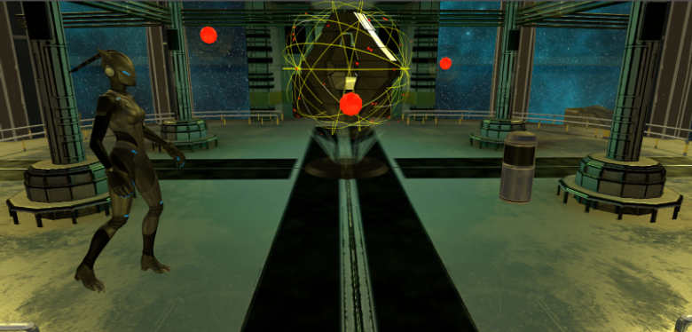

## Space crystal

    
  </a>

> In the "Space Crystal" mission, the main character, Lynx, needs to complete a mission by
finding a special crystal, which is located on a hidden space station in the galaxy, and
return it to home planet. After a long journey and many difficulties, Lynx has finally
found the space crystal and now faces the final challenge of the mission. Lynx needs to
defeat the guards that are protecting the crystal from non-allies. The guards fly around the
crystal and can paralyze anyone they meet on their way. So, the main character needs to
be very careful and somehow get close to the crystal and take it away, thus completing
the mission.

Final project for "Interactive Graphics" course.

### 🎮 Game demo

[**PLAY**](https://mms-ngl.github.io/ig-fp/) 
 
(Demo loading may take some time.. )

### 🕹️ Controls

- **⬇️**: Move forward 
- **⬆️**: Move backward
- **⬅️**: Move left  
- **➡️**: Move right

### 📝 Project documentation

[**REPORT**](https://github.com/mms-ngl/ig-fp/blob/main/report.pdf)

### 📚 Libraries and resources

- [Three.js](https://threejs.org/) is a cross-browser JavaScript library and application programming interface (API) used to create and display animated 3D computer graphics in a web browser using WebGL. 

- [Tween.js](https://github.com/tweenjs/tween.js) is a JavaScript (TypeScript) tweening engine for easy animations, incorporating optimised Robert Penner's equations.

- [Sketchfab](https://sketchfab.com/3d-models?date=week&features=downloadable&sort_by=-likeCount) is a 3D modeling platform website to publish, share, discover, buy and sell 3D, VR and AR content.

